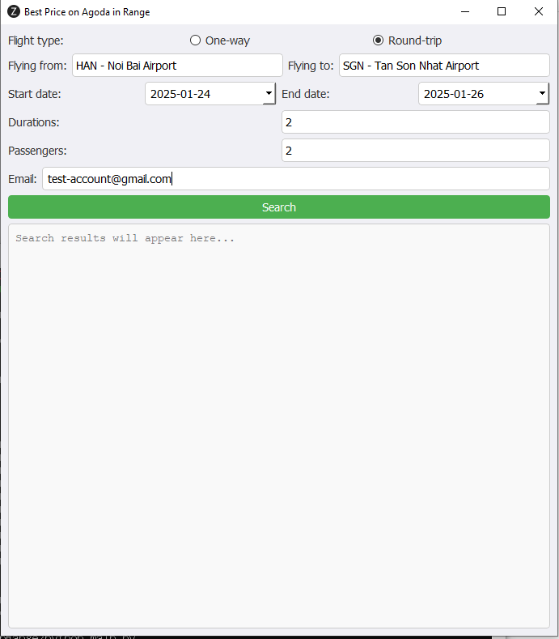

# **Best Price on Agoda in Range**  

## :sparkles: **Overview**  
This Python application helps you find the **best flight prices on Agoda** within a specified date range. Users can customize their search by selecting:
- **Flight types**
- **Destinations**
- **Durations**
- **Number of passengers**

Search results can be viewed within the app or received via email. Additionally, users can easily navigate to the booking page to finalize their purchase.

---

## :dart: **Features**  
- **Choose flight type**: One-way or Round-trip.  
- **Select origin and destination airports**.  
- **Define the date range** to search for the best prices.  
- **Specify trip duration** and number of passengers.  
- **Enter your email** to receive flight details directly.  
- **Easy navigation** to the ticket booking page.  

---

## :wrench: **How to Use**  
1. **Select "Flight type"**: Choose between One-way or Round-trip.  
2. **Select "Flying from"** and **"Flying to"**: Choose your departure and arrival airports.  
3. **Select "Start date"** and **"End date"**: Define the date range to search for the best prices.  
4. **Specify "Durations"**: Set the number of days for your trip.  
5. **Select "Passengers"**: Choose the number of adult travelers.  
6. **Enter your email address** in the "Email" field to receive flight details.  
7. Press the **"Search"** button to begin your search.  

:bulb: **Note**: Search results will display in the text area below the form, or you can check your email for the details.  
:link: **Click "Click here"** to navigate to the ticket booking page.

---

## :camera: **Screenshots**  

### **Application Interface**  
  

### **Search Results Example**  
  

---

## :gear: **Environment Setup**  

### :snake: **Python**  
- **Python Version:** `3.13.0`  
- **Pip Version:** `24.2`  

### :chrome: **Chrome**  
- **Browser Version:** `132.0.6834.83 (Official Build) (64-bit)`  
- **Chrome Driver:** Stable `132.0.6834.110`  
  - [Download ChromeDriver for Windows 32-bit](https://storage.googleapis.com/chrome-for-testing-public/132.0.6834.110/win32/chromedriver-win32.zip)  
  - [Download ChromeDriver for Windows 64-bit](https://storage.googleapis.com/chrome-for-testing-public/132.0.6834.110/win64/chromedriver-win64.zip)  

### :computer: **Operating System**  
- **Windows Edition:** Windows 10 Pro  
- **Version:** 22H2  
- **OS Build:** 19045.5371  
- **Experience Pack:** 1000.19060.1000.0  

---

## :package: **Installation**  

1. **Create a Python Virtual Environment**:  
   ```bash
   python -m venv webScrap
2. **Activate the Virtual Environment**:

On Windows:
    ```bash
    webScrap\Scripts\activate
3. **Install Required Dependencies**:
    ```bash
    pip install -r requirements.txt
:runner: Running the Application
Using Python
Activate the virtual environment and run the script:
    ```bash
    webScrap\Scripts\activate
    python mail.py
Using the Batch File
Alternatively, you can run the batch file:
    ```bash
    run.bat
:hands: Contributions
Feel free to fork this repository, open issues, and submit pull requests to improve the application.

:heart: Enjoy finding the best flight deals on Agoda!

Let me know if you want any edits or additional details!